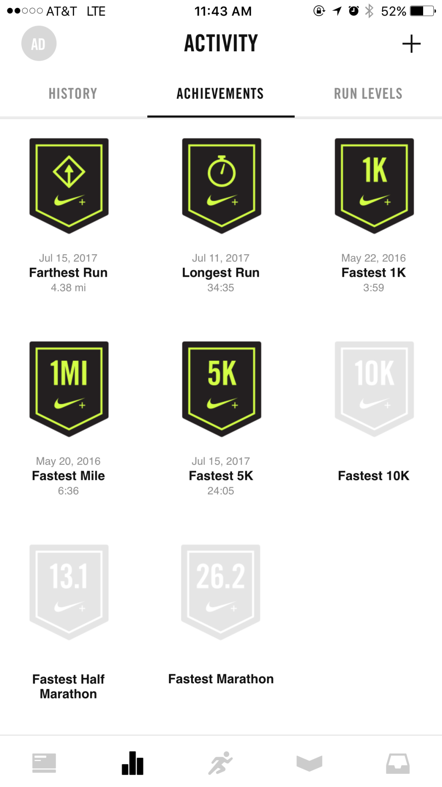
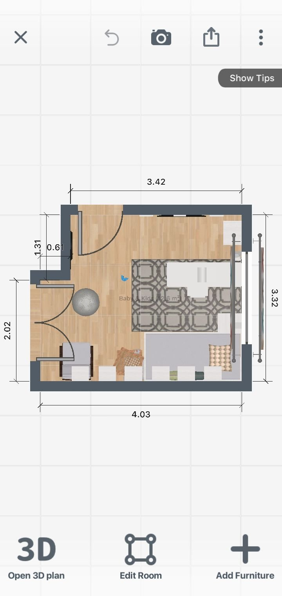

# PEC3: Visionando el futuro con las gafas de Manovich 

### Repositorio para la realización de la PEC3 de la asignatura de Cultura digital de la UOC

Estudios: Grado en Técnicas de Integración Digital y Multimedia

Asignatura: Cultura Digital

Autor: Cristina López Herraiz

Fecha: 16/12/2023

___

## Planteamiento

En este proyecto se investigarán y analizarán dos casos de aplicaciones que han adoptado el concepto de hibridación, desde la perspectiva de Lev Manovich.

**¿Qué es la hibridación?**

Lev Manovich define la hibridación de los medios como la **integración de dos o más medios para formar algo novedoso o mejorado**. Esta tendencia ha ganado prevalencia en los últimos años, a medida que las tecnologías digitales han hecho facilitar la combinación de distintos tipos de contenido.

> _"Los híbridos pueden combinar y reconfigurar formatos de medios conocidos e interfaces de medios para ofrecer nuevos tipos de representación híbridas." - Lev Manovich_

Lev Manovich, reconocido autor de libros sobre teoría de nuevos medios y profesor de informática en City University of New York, Graduate Center, Estados Unidos, así como profesor visitante en la European Graduate School en Saas-Fee, Suiza. La investigación y la enseñanza de Manovich se centra en las humanidades digitales, la informática social, el arte y la teoría de los nuevos medios, y los estudios de software. Su libro académico más reciente, titulado _"El software toma el mando"_, fue publicado en 2013.

En este libro, Manovich sostiene la idea de que el software no solo es una herramienta, sino tambien un medio cultural. Esto se evidencia al observar que ciertos productos o servicios han genberado comunidades a su alrededor, dónde la comunidad evalía, valora y opina sobre las novedades propuestas o lanzadas.

## Nike Training Club
En el ambito del fitness y la salud, la aplicación Nike Trianing Club se destaca como un ejemplo vibrante de hibridación. Ofrece más de 200 ejercicios y programas de entrenamientos específicos, junto con clases de entre 5 a 50 minutos que se pueden seguir en casa, en el gimnasio o al aire libre.

La hibridación en este contexto no solo implica la convergencia de diseño y tecnología, sino también la sinergia entre el usuario y la máquina para lograr una experiencia integral de bienestar.

Nike reconoce que la falta de motivación es a menudo un obstáculo para el ejercicio constante. Para abordar esto, Nike Run Club ofrece:

* Ayuda para superar esa falta de motivación.
* Incentivos para continuar entrenando y alcanzando objetivos.
* Seguimiento por GPS.
* Entrenamientos de carrera guiados.
* Planes de entrenamiento personalizados.
* Motivación a través de amigos y otros usuarios mientras se divierten.

La aplicación utiliza elementos de gamificación para fomentar la participación y retención de los usuarios, haciendo que el entrenamiento sea más agradable. La **gamificación** es una técnica que traslada la mecánica de los juegos al ámbito educativo-profesional para obtener mejores resultados. Nike Training Club anima a los usuarios a registrar sus sesiones y participar en desafíos, muchos de los cuales ofrecen medallas y premios para animar y motivar a los usuarios. Esto hace aumentar la confianza de los usuarios y la partifcipación.

El uso efectivo de la gamificación ha resultado en un aumento significativo en la retención de usuarios para Nike en los últimos años. Además, la aplicación integra la venta de productos Nike para correr, facilitando la compra online directamente desde la aplicación. Las recomendaciones de productos se personalizan según las preferencias de los usuarios (su perfil y estilo de carrera), incentivando así constantemente a los usuarios a adquirir nuevos productos de Nike.

## Room Planer
Room Planner es una aplicación de Ikea diseñada para planificar y decorar tus espacios de domésticos mediante realidad aumentada, permitiéndote visualizar cómo se verán los muebles y accesorios del catálogo de IKEA en una habitación específica de tu casa.

La hibridación se evidencia claramente en la capacidad del software para simular entornos de manera realista. Los usuarios pueden ver sus diseños en tiempo real, lo que convierte a la hibridación no solo en una tendencia en la era digital, sino en un motor poderoso de innovación y creatividad.

Con la realidad aumentada, es posible escanear cada rincón y altura de la habitación, facilitando la medición precisa de los espacios de manera rápida y sencilla, lo que a su vez  ahorra tiempo y dinero. Ideal para hacer renovaciones del hogar o cuando se desea cambiar la disposición de los muebles en una habitación. Además, la aplicación ofrece proyectos ya hechos para aquellos que prefieren no diseñar todo desde cero.

El usuario simplemente tiene que apuntar la cámara a cada esquina de la habitación, y la aplicación crea un modelo en 3D que se puede medir con precisión mediante herramientas virtuales como reglas, medidores de distancia y herramientas de nivelación, entre otras. 

Room Planer te permite:
* Crear planos detallados de tu espacio.
* Añadir objetos de decoración.
* Cambiar los colores y materiales de los muebles.
* Ajustar la iluminación.
* Incluir elementos como personas o mascotas para visualizar el diseño deseado.
* Compartir los diseños en redes sociales para obtener comentarios de amigos.

Este tipo de herramientas se vuelven cada vez más populares y apreciadas, tanto por diseñadores de interiores y arquitectos como por aquellos que aman el orden y cuidan meticulosamente la distribución de elementos en sus hogares.

## Bibliografía y Webgrafía

* Manovich, Lev. (2013). **El Software toma el mando**. Barcelona: Editorial UOC.

* En Wikipedia. "Lev Manovich". [Lev Manovich - Wikipedia](https://es.wikipedia.org/wiki/Lev_Manovich).
  
* En GoodUX. "El enfoque gamificado de Nike Run Club para el entrenamiento físico". [El enfoque gamificado de Nike Run Club para el entrenamiento físico - GoodUX](https://goodux.appcues.com/blog/nike-run-club-gamification)

* En Realidad Aulemntada. "Apps para hacer planos y medir habitaciones en realidad aumentada" [Apps para hacer planos y medir habitaciones en realidad aumentada - Realidad Aumentada](https://realidadaumentada.click/apps-para-hacer-planos-y-medir-habitaciones-en-realidad-aumentada/)

* Imagen 1. Imagen de plataforma Nike Run Club. Fotografía de GoodUX. [Imagen de plataforma Nike Run Club - GoodUX](https://goodux.appcues.com/blog/nike-run-club-gamification)

* Imagen 2. Imagen de plataforma Room Planer en Android. Fotografía de Malavida. [Imagen de plataforma Room Planer en Android - Malavia](https://www.malavida.com/es/soft/room-planner/android/)
